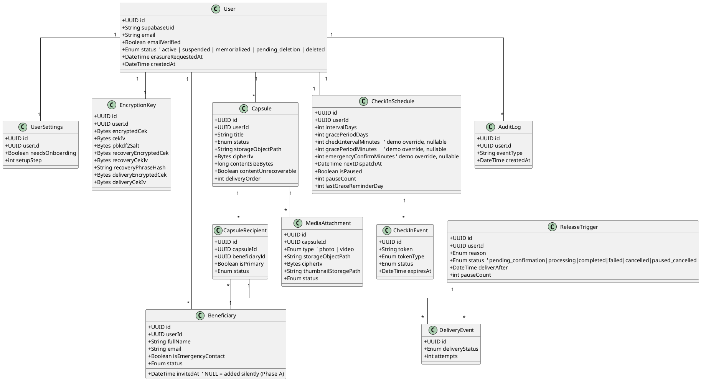
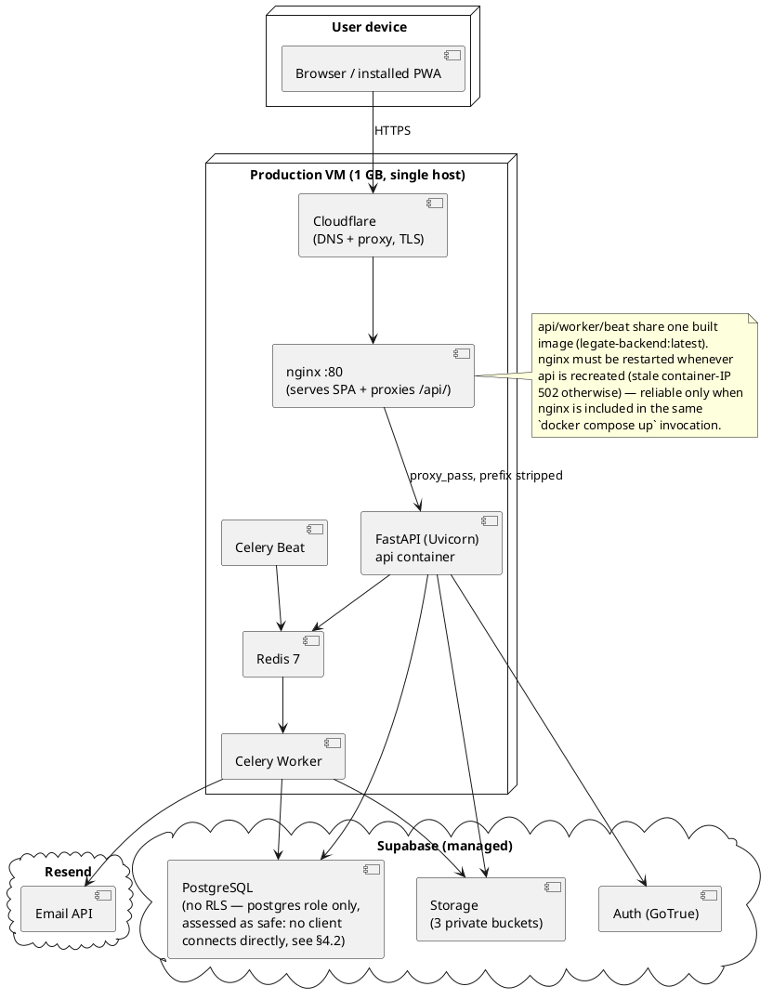
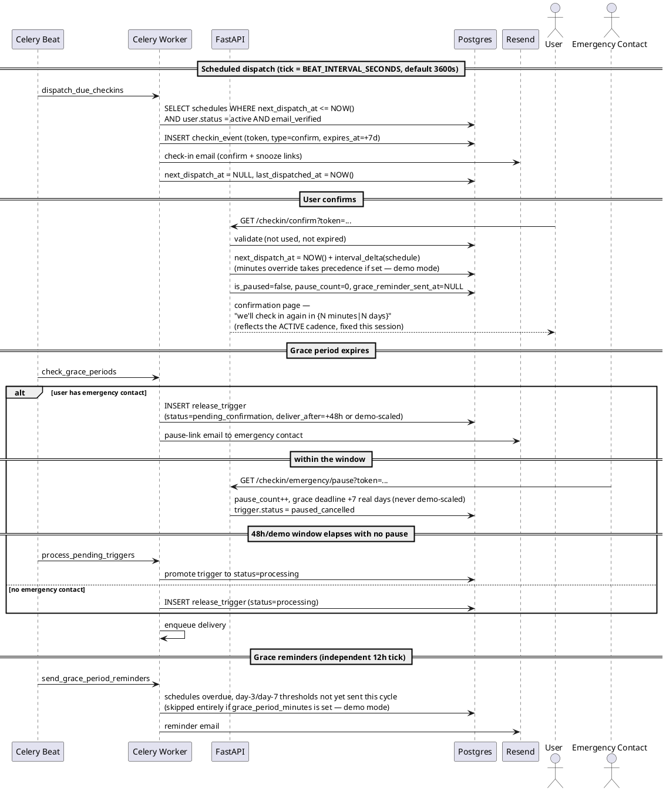
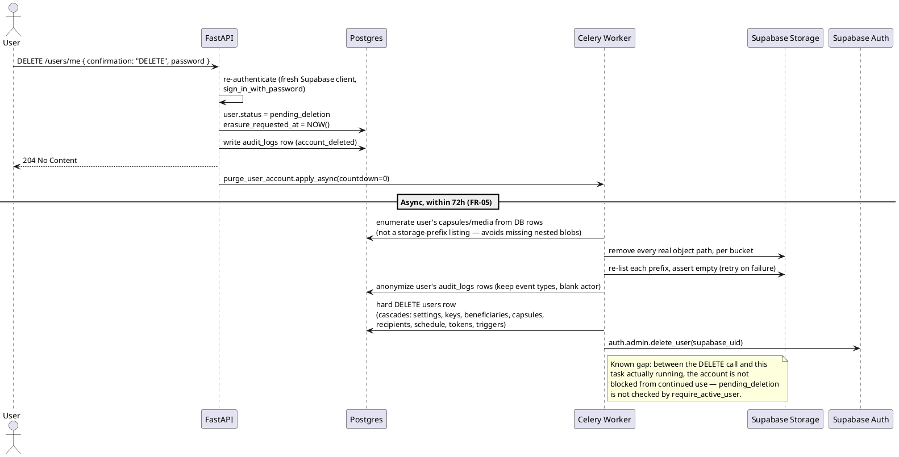

# Legate — Product Requirements Document v3.0

**Document version:** 3.0 — As-built, post-implementation
**Status:** Reflects the deployed system as of July 2026
**Date:** July 2026
**Author:** Engineering (compiled from six implementation-phase documents + Plan Phases A–C)
**Platforms:** Web (installable PWA) only. A native mobile app wrapper has been scoped out for now — see §2.3.
**Confidentiality:** Internal use only

---

## Revision History

| Version | Date | Author | Change Summary |
|---------|------|--------|----------------|
| 1.0 | March 2026 | Product Team | Initial draft — decentralized storage architecture |
| 2.0 | May 2026 | Product Team | Simplified storage: Supabase replaces shard/node network. Dropped community seeders, Shamir's Secret Sharing, monetisation tiers. Added PWA + native mobile targets. Hybrid encryption model. |
| 3.0 | July 2026 | Engineering | **As-built revision.** Rewritten against the actual deployed codebase after six implementation phases (deploy blockers → backend logic → frontend critical bugs → PRD P0 feature gaps → security hardening → final E2E) plus three post-launch feature phases (Plan A–C: silent beneficiary add, demo-mode minute-level scheduling, rich HTML emails). Formally scopes out the native mobile wrapper (the PWA already delivers the app-like experience — see §2.3), documents features added beyond the original PRD (demo mode, GDPR soft-delete + async purge, logout, emergency-contact pause lifecycle), and replaces the v2.0 data model / UML diagrams with the current schema and flows. |

---

## 1. Executive Summary

Legate is a digital estate planning application that lets a user compose personal messages — text, photos, and video — addressed to nominated beneficiaries, to be delivered automatically if the user becomes unreachable for an extended period.

The product operates on a check-in mechanism: users receive a periodic email and confirm they are well with a single click. Sustained non-response through a configurable grace period — with an optional emergency-contact pause window in between — triggers message delivery to nominated beneficiaries.

Legate is delivered today as an installable web Progressive Web App. It is deployed as a single Docker Compose stack (nginx + FastAPI + Celery worker + Celery beat + Redis) in front of a managed Supabase project (Postgres + Auth + Storage), fronted by Cloudflare, running in production at `legate.one`.

Content is encrypted client-side using the Web Crypto API (AES-256-GCM) before it ever leaves the browser. The server never holds a usable plaintext key: it stores only an encrypted Content Encryption Key (CEK) blob, wrapped independently under three separate keys (password-derived, recovery-phrase-derived, and a system-held delivery key — see §5.3). No plaintext capsule content is ever stored or logged server-side.

This version of the document is written against the system as it exists after six audit-remediation phases and three follow-on feature phases, not as a forward-looking design. Every functional requirement below reflects real, verified behavior unless explicitly marked otherwise.

---

## 2. Goals & Non-Goals

### 2.1 Goals (unchanged from v2.0, still accurate)

**Product goals**
- Deliver a setup experience completable in under 7 minutes by a non-technical user
- Achieve a check-in false-trigger rate of 0.00%
- Achieve a delivery reliability rate of 99.9%+ when legitimately triggered
- Ensure no Legate employee can read any user's message content at any time
- Support text, photo, and video content
- Be fully installable and partially functional offline as a PWA

**Technical goals**
- Single deployable codebase, Docker Compose, any Linux host
- Auto-generated API documentation via FastAPI/Swagger
- GDPR-compliant data handling with right-to-erasure support

### 2.2 Non-Goals (unchanged from v2.0)

- Legate is not a password manager
- Legate is not a legal will
- Legate will not integrate with financial institutions or government registries
- Legate will not support group or collaborative wills
- Legate will not provide AI-assisted message drafting
- Legate has no monetisation tiers — all features available to all users
- Legate does not use a community seeder or distributed node network

### 2.3 Scope correction from v2.0 — what was actually built

v2.0 committed to "Web (desktop), Installable PWA, native wrapper (iOS/Android)" as day-one platforms. As of this revision:

- **Built and live:** the web PWA. Installable, offline-capable for cached metadata, deployed to production.
- **Native mobile app: scoped out for now.** This is a deliberate decision, not an in-progress gap. The installable PWA already provides the app-like experience on phones — home-screen icon, standalone window, offline access to cached metadata — so a separate native wrapper isn't needed to meet the product's mobile goals today. FR-04 (biometrics) and FR-17 (push notifications), which would depend on a native shell, are correspondingly out of scope for now rather than pending.
- **Not built:** independent CDN hosting of the frontend (Vercel/Netlify) described in v2.0 §5.5. The frontend is served by the same nginx container that reverse-proxies the API — see §5.5 below for the actual deployment topology.
- **Not enabled in a way that does anything (NFR-14):** Supabase Row Level Security. This was reassessed during this revision and is **not considered a gap given the current architecture** — see the note at the end of §4.2 and §11.3 for the reasoning. Enabling RLS policies in the Supabase dashboard alone has no effect here, because the backend never connects as a role RLS applies to (see below).

---

## 3. Stakeholders & Personas

Unchanged from v2.0 — still representative of the target users.

### 3.1 Internal Stakeholders

| Role | Responsibility |
|------|---------------|
| Product Manager | Owns this document; arbitrates scope decisions |
| Engineering Lead | Validates technical feasibility; owns architecture decisions |
| Design Lead | Owns UX flows and visual system |
| Security Architect | Owns encryption and key management |
| Legal Counsel | Reviews compliance requirements |

### 3.2 User Personas

**Persona A — Tariq, 44, software engineer.** Father of two with crypto holdings, a YouTube channel, and 15 years of digital assets. Wants to leave clear instructions for his wife. Values architectural transparency.

**Persona B — Maryam, 61, retired teacher.** Not highly technical. Wants to leave video messages for grandchildren at life milestones. Needs simple setup with no jargon.

**Persona C — Daniyar, 35, freelance digital nomad.** Multiple online accounts, large social following. Needs highly configurable check-in scheduling and the ability to snooze without opening the app. Travels constantly.

---

## 4. Assumptions & Constraints

### 4.1 Assumptions (unchanged)

- Users have access to at least one reliable email address, checked as frequently as their check-in interval
- Beneficiaries do not need the app installed — delivery is via email
- The check-in confirmation link must work without app login
- Users understand Legate is not a legal instrument

### 4.2 Constraints (updated)

- **Technical:** Client-side encryption means Legate cannot perform server-side search of capsule content.
- **Technical:** The CEK-wrapping key is derived from the user's password via PBKDF2. Key loss (forgotten password with no recovery phrase) means permanent content loss for capsules encrypted under that CEK — **mitigated** by the recovery-phrase flow (§5.3, §6.1) and by the delivery-time wrapping key, which lets the system complete a triggered delivery independent of whether the user's password or recovery phrase is ever recovered.
- **Legal:** Legate cannot legally declare a user dead; the trigger is inability to respond, not death. All copy reflects this.
- **Legal:** GDPR right to erasure implemented as a soft-delete + asynchronous purge (§6.1, FR-05) completing within 72 hours, not an instant hard delete.
- **Storage:** Supabase Storage holds encrypted media/content blobs; Supabase Postgres holds all structured data. Row Level Security is not enabled (§2.3).
- **New constraint (operational):** the production deployment runs on a single low-RAM (1 GB) host. `UVICORN_WORKERS` and `CELERY_CONCURRENCY` are tuned down accordingly (see §5.5). This caps throughput; horizontal scaling is not yet implemented.

**On RLS specifically — assessed as safe as-is, not a deferred risk.** This was re-examined during this revision by tracing the actual connection code, not just the dashboard toggle. `backend/app/db/session.py` opens every Postgres connection via `DATABASE_URL`, which per `.env.example` connects as the `postgres` role (`postgresql://postgres:<password>@db.<project>.supabase.co:5432/postgres`) — the table-owning role, which bypasses RLS regardless of what policies exist. `backend/app/core/supabase.py` uses the service-role key for every Storage and Auth-admin call, which also bypasses RLS/storage policies by design. Critically, the frontend has **no direct path to Supabase at all**: there is no `@supabase/supabase-js` (or any Supabase SDK) anywhere in `frontend/src`, confirmed by search. `VITE_SUPABASE_URL` / `VITE_SUPABASE_ANON_KEY` are declared in `frontend/.env.example` but are dead/unreferenced — leftover scaffolding, not a live code path. Every request from the browser goes through nginx to the FastAPI backend, which is the sole holder of any Supabase credential. This makes Legate's architecture equivalent to any traditional app with its own backend and database user with full table access (Django/Rails/Express-with-Postgres, etc.) — a pattern that has never depended on database-level row policies, because the database is never exposed to an untrusted caller. RLS exists specifically for architectures where a browser or mobile client talks to PostgREST/Storage directly using a JWT-scoped `anon`/`authenticated` role; Legate doesn't do that anywhere today. Conclusion: turning on RLS in the dashboard was a reasonable instinct but doesn't add real protection under the current design, and enabling it fully (rewriting the data-access layer to run as the authenticated user per-request) is not something the current architecture needs. It should be revisited only if a future feature has the browser talk to Supabase directly — at that point RLS becomes mandatory, not optional.

---

## 5. System Architecture Overview

### 5.1 Tech Stack (as built, with actual versions)

| Layer | Technology |
|-------|-----------|
| Frontend | React 18.3, Vite 5.4, TypeScript 5.6, Tailwind CSS 3.4 |
| Rich text editor | TipTap 2.6 (StarterKit: bold/italic/bullet list + character count), 10,000-char limit |
| PWA | `vite-plugin-pwa` 0.20 / Workbox — installable manifest, service worker, `NetworkFirst` runtime caching for `/api/*` GETs, IndexedDB (`idb`) react-query persistence |
| Client encryption | Web Crypto API — AES-256-GCM content, PBKDF2 key derivation |
| Recovery phrase | `@scure/bip39` (24-word BIP-39, no Buffer/Node-dependency issues) |
| PDF export | `jspdf` — recovery phrase and (client-side) other exports |
| Backend | FastAPI 0.111 (Python), Uvicorn 0.29 (ASGI, `--proxy-headers --forwarded-allow-ips=*`) |
| ORM / migrations | SQLAlchemy 2.0 (async, asyncpg), Alembic 1.13 |
| Task queue | Celery 5.4 + Redis 5.0 (broker + result backend) |
| Database | Supabase-managed PostgreSQL |
| File storage | Supabase Storage (3 private buckets) |
| Authentication | Supabase Auth (GoTrue) — email/password + OTP verification; backend validates Supabase-issued JWTs (HS256 or ES256 via JWKS) |
| Email | Resend (`resend` Python SDK) |
| Rate limiting | `slowapi` + Redis-backed limiter (100/min authenticated default, 5/min on auth endpoints) |
| HTML sanitization | `bleach` (rich-text allowlist: `b,strong,i,em,ul,li,p,br`) |
| Reverse proxy / static host | nginx (alpine), serves the built SPA and proxies `/api/` to the backend with the prefix stripped |
| Deployment | Docker Compose, single VM, Cloudflare in front |
| API docs | FastAPI auto-generated Swagger UI at `/api/docs` in production (root-path-aware) |

### 5.2 Component Overview

| Component | Description | Trust Boundary |
|-----------|-------------|----------------|
| React PWA | All content creation, client-side encryption, upload. Plaintext CEK held in memory only, never persisted. | Fully trusted — user's device |
| nginx | Serves the built SPA at `/`, reverse-proxies `/api/` to the API container with the prefix stripped, terminates the one host port. | Trusted, stateless |
| FastAPI backend | Auth, check-in scheduling, grace-period logic, delivery triggering. Stores only encrypted key blobs. Never sees plaintext content in normal operation. | Trusted, audited |
| Celery worker | Executes scheduled tasks: check-in dispatch, grace-period checks, pending-trigger promotion, delivery, GDPR purge. **This is the one process that reconstructs plaintext**, in memory, at delivery time only. | Trusted, internal — see §5.3 |
| Celery beat | Schedules the four periodic tasks (§5.4). Tick interval configurable (`BEAT_INTERVAL_SECONDS`, see §5.6 demo mode). | Internal only |
| Redis | Celery broker/result backend and the rate-limiter's counter store. No user content. | Internal only |
| Supabase Postgres | All structured data. Accessed via the `postgres` role — **no RLS in effect** (§4.2 — assessed as safe given no client ever connects directly). | Trusted, encrypted at rest, authorization enforced entirely at the FastAPI layer |
| Supabase Storage | AES-256-GCM-encrypted content and media blobs, 3 private buckets. | Trusted, double-encrypted |
| Supabase Auth | Email/password auth, OTP email verification, password-reset magic links. Backend independently verifies the issued JWT (HS256 legacy or ES256 via JWKS). | Third-party managed |
| Resend | Transactional email — check-in, reminder, nomination, delivery, alert emails. | Third party |
| Backend-rendered check-in pages | `GET /checkin/confirm`, `/checkin/snooze`, `/checkin/emergency/pause` return standalone HTML directly from FastAPI — no frontend route, no login required, token-authenticated. | Trusted, stateless |

### 5.3 Encryption Architecture (updated — three independent CEK wraps, not one)

This is the most significant architecture change from v2.0, which described a single password-wrapped CEK plus a recovery phrase as a conceptual backup. The current system maintains **three separately-wrapped copies of the same CEK** on the `encryption_keys` row, each usable independently:

1. **Primary (password) wrap** — `encrypted_cek` / `cek_iv` / `pbkdf2_salt` / `pbkdf2_iterations` (default 100,000). A 256-bit CEK is generated client-side (`crypto.getRandomValues()`), wrapped with AES-256-GCM under a key derived from the user's password via PBKDF2-SHA256. This is what the browser uses day-to-day.
2. **Recovery-phrase wrap** — `recovery_encrypted_cek` / `recovery_cek_iv` / `recovery_salt` / `recovery_phrase_hash`. A 24-word BIP-39 phrase, generated client-side at setup, derives a second wrapping key; the same CEK is independently re-wrapped under it. `recovery_phrase_hash` (SHA-256 of the normalized mnemonic) lets the server validate a submitted phrase without ever storing the phrase itself. This is the path that makes "forgot password ≠ permanent data loss" actually true — a full recovery flow (email + 24 words → unwrap via recovery blob → re-wrap under a new password) exists and is tested. **"Re-display recovery phrase" is implemented as regenerate-and-replace**, not reveal-the-original: the server-held blob is derived material, not the phrase itself, so the original text is cryptographically unrecoverable by design. This is a deliberate, documented deviation from a literal reading of FR-35/FR-10.
3. **Delivery wrap** — `delivery_encrypted_cek` / `delivery_cek_iv`. Wrapped under an HMAC-SHA256-derived key (`HMAC(DELIVERY_SECRET, user_id)`), computed server-side and never transmitted to the browser. This is what lets the delivery worker decrypt a triggered account's capsules **without needing the user's password or recovery phrase at all** — the worker is the only component that ever holds this derived key, and only in memory, for the duration of a delivery run. **Operational implication:** rotating `DELIVERY_SECRET` invalidates every existing delivery-wrapped blob; this is documented as destructive in `README.md` and `docs/SECURITY.md`.

Data flow through these three wraps:
- Signup: client generates CEK, wraps it under the password-derived key, uploads the primary blob. Recovery-phrase wrap is created during the setup wizard's recovery step. Delivery wrap is created server-side at the same time (or lazily, before it's first needed).
- Day-to-day use: browser derives the password-based key, unwraps the primary blob, holds CEK in memory only (never localStorage/sessionStorage).
- Password reset: recovery-phrase wrap unwraps the CEK, which is then re-wrapped under the new password.
- Delivery: the Celery worker independently unwraps the CEK using the delivery wrap — no user interaction, no password, no recovery phrase needed at trigger time.

### 5.4 Data Flow — Content Creation to Delivery (updated)

1. User writes a capsule (rich text via TipTap) and optionally attaches photos/video.
2. Web Crypto API encrypts content with the in-memory CEK (AES-256-GCM, random IV). Large video is encrypted in chunks (chunked AES-GCM format documented in `crypto/media.ts`) since Web Crypto cannot stream AES-GCM natively.
3. Encrypted content and media blobs upload to Supabase Storage via signed upload URLs issued by the API; metadata (title, beneficiary, cipher IV, content hash, size, delivery order) is stored in Postgres — never plaintext.
4. Celery beat dispatches check-in emails on schedule via Resend.
5. User confirms via the backend-rendered confirm page; the schedule's `next_dispatch_at` is recomputed and, since Phase B, this recompute correctly reflects whichever cadence (day-based or demo-mode minute override) is actually active.
6. On grace-period expiry: if the user has an emergency contact, a `pending_confirmation` release trigger is created with a 48-hour (or demo-scaled) window and the contact is emailed a pause link; otherwise the trigger goes straight to `processing`.
7. The delivery worker retrieves the delivery-wrapped CEK, decrypts each capsule and its media in memory, renders one email per beneficiary (capsules in `delivery_order`, photos inline/gallery, video as a signed link), sends via Resend, and discards plaintext immediately. Failed recipients are retried (up to 3 attempts) without re-sending to already-successful recipients.
8. On completion the user's account is memorialized (read-only); all Storage objects under the user's prefix are purged within 72 hours by a scheduled cleanup task, which re-lists each prefix after deletion and retries if anything remains.

### 5.5 Deployment Architecture (rewritten — this is materially different from v2.0)

v2.0 envisioned the frontend on Vercel/Netlify and the backend on a separate Railway/Render host. **The actual deployment is a single Docker Compose stack on one VM:**

- `nginx` — builds from `frontend/Dockerfile`, which copies a **pre-built** `frontend/dist/` into an nginx-alpine image (the frontend is built with `npm run build` outside Docker — Docker Desktop / low-bandwidth npm installs inside the image proved unreliable — then the compiled `dist/` is copied in). Serves the SPA at `/`, proxies `/api/` to `api:8000` with the prefix stripped. `depends_on: api (condition: service_healthy, restart: true)` — a documented, imperfect mitigation for a known nginx gotcha: nginx resolves the `api` hostname once at its own startup, so if `api` is recreated (getting a new container IP on the docker network) without nginx also restarting, nginx serves 502s against a dead IP until it is manually restarted. This fires reliably on a full `docker compose up`, but **not** when only a subset of services is targeted with `--force-recreate` — always include `nginx` explicitly in any manual recreate of `api`.
- `api` — FastAPI/Uvicorn, `--workers` configurable (`UVICORN_WORKERS`, default 2, set to 1 on the 1 GB production host), migrations (`alembic upgrade head`) run automatically and idempotently in the entrypoint before Uvicorn starts. Hardcoded to Google DNS (`8.8.8.8`/`8.8.4.4`) to avoid intermittent Docker embedded-DNS resolution failures against Supabase's hostname seen in production.
- `worker` / `beat` — same image as `api` (`legate-backend:latest`, built once, reused — no separate pip install), different `command:`. Concurrency configurable (`CELERY_CONCURRENCY`, default 2, set to 1 on low-RAM hosts).
- `redis` — official `redis:7-alpine`, internal only, no host port published, no auth (compose-internal network only).
- Supabase and Resend are consumed as managed external services, unchanged from v2.0.
- **Production specifics:** deployed on a 1 GB Oracle Cloud micro instance, `legate.one`, fronted by Cloudflare (DNS + proxy). `NGINX_PORT` defaults to 80. A `DEMO_MODE` flag (§5.6) exists specifically to support live product demos on this same production URL without a separate staging environment.

No CI/CD pipeline, staging environment, or automated deploy-on-merge exists today (v2.0 §5.5 and the UML CI/CD diagram were aspirational; deploys are manual: build frontend locally → `scp` the `dist/` to the VM → `docker compose build` → recreate the changed services).

### 5.6 Demo Mode (new in v3.0 — not present in v2.0 at all)

Added post-launch (Plan Phase B) to let the check-in → missed → grace → release → delivery lifecycle be rehearsed live in minutes instead of weeks, without touching the real day-based scheduling columns.

- `CheckInSchedule` gains three **nullable override columns**: `check_interval_minutes`, `grace_period_minutes`, `emergency_confirm_minutes`. When any is set, it takes precedence over the corresponding day-based column (`interval_days`, `grace_period_days`, or the hardcoded 48-hour emergency-confirmation window) via `app/core/scheduling.py`'s `interval_delta()` / `grace_delta()` / `emergency_confirm_delta()` helpers — the single source of truth every scheduling call site goes through.
- Writable **only** when the server-side `DEMO_MODE` env var is true; the API rejects minute-field writes with 403 otherwise. This is enforced in the endpoint, not just hidden in the UI.
- `BEAT_INTERVAL_SECONDS` controls how often Celery beat ticks the dispatch/grace/trigger-promotion tasks (default 3600s = hourly; lowered to e.g. 60s only while demo mode is actively in use). Leaving a short tick interval on permanently, in production, ticks the grace-period check against every user on that cadence forever — a real performance cost, not just a demo convenience.
- Not demo-scaled by design: the emergency-contact **pause extension** (always +7 real days, FR-24) remains day-based even in demo mode — pausing is a deliberate action a real emergency contact takes, not part of the passive missed-check-in timeline a demo needs to compress. A demo rehearsal that exercises the pause path will add a real 7 days to that trigger.
- Normal-mode behavior with default env values is unchanged: all math is day-based, byte-for-byte identical to pre-demo-mode behavior.

---

## 6. Functional Requirements

Priority notation unchanged: **P0** = must have, **P1** = ships shortly after, **P2** = future roadmap. Status column added in v3.0: **✅ Built**, **⚠️ Partial**, **❌ Not built**.

### 6.1 Authentication & Account Management

| ID | Priority | Status | Requirement |
|----|----------|--------|-------------|
| FR-01 | P0 | ✅ | Create account with email + password (min 12 chars, 1 number, 1 special character). |
| FR-02 | P0 | ✅ | Email verification via 6-digit OTP (Supabase) before app access. |
| FR-03 | P0 | ✅ | Password reset via Supabase magic link; on completion, CEK is unwrapped via the recovery-phrase blob and re-wrapped under the new password. A legacy account with no recovery blob gets an explicit "content unrecoverable" path rather than a silent failure. |
| FR-04 | P1 | Scoped out | Biometric auth — requires a native app shell; scoped out along with native mobile (§2.3). |
| FR-05 | P0 | ✅ | **Account deletion is a soft-delete + async purge, not instant.** User re-authenticates with their password and types "DELETE"; account is immediately flagged `pending_deletion`; a Celery task then purges Supabase Storage objects (verified by re-listing), anonymizes the user's audit-log rows, hard-deletes the `users` row (cascading to all owned tables), and deletes the Supabase auth user — all within 72 hours. **Known gap:** between the delete request and the purge task actually running, the account is not blocked from continued use (`pending_deletion` is not checked by `require_active_user`) — in practice the purge is enqueued immediately, but there is no hard guarantee under load. |
| FR-06 | P1 | ❌ | Change registered email — not built. |
| FR-05b | — (new) | ✅ | **Logout.** Added in this revision: a "Log Out" control on the Security page revokes the refresh token server-side (best-effort) and clears local session/crypto state via a hard page reload (`window.location.href`, not client-side routing) so the app's one-time bootstrap effect re-runs cleanly. |

### 6.2 Onboarding & Setup Wizard

| ID | Priority | Status | Requirement |
|----|----------|--------|-------------|
| FR-07 | P0 | ✅ | Skippable onboarding carousel on first launch. |
| FR-08 | P0 | ✅ | 4-step wizard: check-in config → beneficiary → capsule (skippable) → recovery phrase. |
| FR-09 | P0 | ✅ | Resumable — server-persisted `setup_step` on `user_settings`. |
| FR-10 | P0 | ✅ | 24-word BIP-39 phrase, confirmation checkbox, copy + PDF export. |

### 6.3 Check-in System

| ID | Priority | Status | Requirement |
|----|----------|--------|-------------|
| FR-11 | P0 | ✅ **(changed)** | Configurable interval: presets 7/14/30/60 days, or custom **1–365 days** (floor lowered from the original 7-day minimum — Plan Phase B, permanent in all environments). |
| FR-12 | P0 | ✅ | Configurable grace period; API now accepts any 1–30 day value (frontend still surfaces 3/7/14/30 presets). |
| FR-13 | P0 | ✅ **(changed)** | Single-click, no-login confirm link. The confirmation page now reports the **actual active interval** — days normally, minutes when a demo-mode override is set (this session's fix; previously always reported the stale day value even in demo mode). |
| FR-14 | P0 | ✅ | Snooze +7/+14/+30 days, max 2 per cycle, remaining allowance shown. Snooze always adds real days, even during a demo-mode minute cycle — not scaled. |
| FR-15 | P0 | ✅ | Confirm/snooze tokens: 64-byte URL-safe, single-use (DB-backed status mutation, not a Redis blacklist — documented NFR-12 deviation), 7-day expiry. |
| FR-16 | P0 | ✅ | Escalating grace reminders at day 3 and day 7 of the grace period, at most once per threshold per cycle; skipped entirely for demo-mode minute-based schedules (day thresholds are meaningless at that scale). |
| FR-17 | P1 | Scoped out | Push notifications — requires a native app shell; scoped out along with native mobile (§2.3). |
| FR-18 | P0 | ✅ | Interval/grace editable any time; shortening grace shows a confirmation warning. |

### 6.4 Beneficiary Management

| ID | Priority | Status | Requirement |
|----|----------|--------|-------------|
| FR-19 | P0 | ✅ | Add beneficiary: name (required), email (required), relationship (optional). |
| FR-20 | P0 | ✅ **(changed)** | Nomination email — **now optional per beneficiary.** `POST /beneficiaries` accepts `notify_beneficiary: bool` (default true); when false, no email is sent, `invited_at` stays NULL, and the beneficiary card shows an "Added silently" badge (Plan Phase A). Silent beneficiaries still receive delivery emails when a trigger fires — silence covers only the nomination notice. |
| FR-21 | P0 | ✅ | Edit name/email. Email change re-sends the nomination **only if** the beneficiary was originally notified (silent stays silent). |
| FR-22 | P0 | ✅ | Remove with confirmation; neutral removal-notification email sent (no account/content details); capsules losing their only recipient get a `has_recipients: false` flag the UI surfaces. |
| FR-23 | P1 | ✅ **(built, not just P1-deferred)** | One beneficiary may be the emergency contact. On grace expiry, if one is set, a `pending_confirmation` trigger is created with a 48-hour window (demo-scalable via `emergency_confirm_minutes`) and the contact is emailed a single-click pause link. |
| FR-24 | P1 | ✅ | Pause extends the grace deadline by a fixed 7 real days (never demo-scaled), max 2 pauses per trigger. A subsequent user confirm fully resets pause state and reminder state. |

### 6.5 Message Capsules

| ID | Priority | Status | Requirement |
|----|----------|--------|-------------|
| FR-25 | P0 | ✅ **(changed)** | Rich-text capsule via TipTap (bold, italic, bullet list), 10,000-char limit with counter. Content stored as sanitized HTML inside the encrypted blob. |
| FR-26 | P0 | ✅ | Autosave every 30s to an **encrypted** localStorage draft (CEK-encrypted at rest, not plaintext); dirty-tracked save indicator. |
| FR-27 | P0 | ✅ | Up to 20 photos/capsule, JPEG/PNG/HEIC, ≤10MB each, client-encrypted before upload via signed URLs; encrypted thumbnail generated client-side. |
| FR-28 | P1 | ✅ | One video/capsule, MP4/MOV, ≤500MB, chunked client-side AES-GCM encryption (Web Crypto cannot stream GCM natively), auto-thumbnail from first frame. |
| FR-29 | P1 | ❌ | Drag-and-drop capsule reordering — not built; `delivery_order` exists and is respected at delivery time, but no reorder UI. |
| FR-30 | P0 (pulled forward from P1) | ✅ | Preview mode: a shared template (`GET /delivery/template`) is fetched and filled client-side with decrypted content inside a "Preview" banner, so preview cannot drift from the real delivery render. |
| FR-31 | P0 | ✅ | Capsule deletion → confirmation dialog → storage purge; `pending_deletion` badge shown until purge completes. |

### 6.6 Storage & Encryption

| ID | Priority | Status | Requirement |
|----|----------|--------|-------------|
| FR-32 | P0 | ✅ | All content encrypted client-side (AES-256-GCM) before upload. |
| FR-33 | P0 | ✅ **(expanded — see §5.3)** | CEK wrapped three independent ways: password, recovery phrase, and a system delivery key. Server never holds a usable plaintext key outside the delivery worker's in-memory reconstruction at trigger time. |
| FR-34 | P0 | ✅ | Metadata in Postgres, never plaintext content. |
| FR-35 | P0 | ✅ **(deviation — see §5.3)** | Recovery phrase: shown once at setup; "re-access" in Security is implemented as **regenerate** (new phrase, re-wraps CEK, invalidates the old phrase), since the original text is not server-recoverable by design. |
| FR-36 | P0 | ✅ | Storage usage progress bar; `limit_bytes` from `STORAGE_QUOTA_BYTES` (default 1 GiB), usage includes both media and text-content blob sizes. |
| FR-37 | P0 | ✅ | Offline viewing of cached capsule metadata (react-query + IndexedDB persistence); encrypted drafts sync via an outbox queue on reconnect. |

### 6.7 Delivery Engine

| ID | Priority | Status | Requirement |
|----|----------|--------|-------------|
| FR-38 | P0 | ✅ | Delivery worker retrieves the delivery-wrapped CEK, decrypts in memory, renders, sends, discards immediately. |
| FR-39 | P0 | ⚠️ **(changed — shorter link life)** | One email per beneficiary, capsules in `delivery_order`, text inline, photos inline/gallery, video as a signed link. **Link validity is 3 days, not the originally-specified 30** — deliberately shortened to match the 72-hour post-delivery storage purge window (a 30-day link pointing at content already deleted at hour 72 would be worse than a short, honest one). This is a conscious, documented product decision, not an oversight. |
| FR-40 | P0 | ✅ | Plain-language, non-alarming explanatory copy in the delivery email. |
| FR-41 | P0 | ✅ | Storage purge within 72 hours of delivery, verified by re-listing each prefix; account becomes read-only/memorialized. |
| FR-42 | P0 | ✅ | Per-recipient retry (not whole-trigger): failed sends retried up to 3 times without re-sending already-successful recipients; internal alert email + audit row on final failure. |
| FR-43 | P1 | ❌ | Emergency-contact delivery-confirmation email — not built. |

### 6.8 Dashboard & Transparency

| ID | Priority | Status | Requirement |
|----|----------|--------|-------------|
| FR-44 | P0 | ✅ | Dashboard check-in status card: status, last confirmed, next due. |
| FR-45 | P0 | ✅ | "How Legate Works" plain-language page. |
| FR-46 | P0 | ✅ | Settings shows storage usage + regenerate-recovery-phrase entry. |

### 6.9 Emails (new section — Plan Phase C)

| ID | Priority | Status | Requirement |
|----|----------|--------|-------------|
| FR-47 (new) | P0 | ✅ | All seven transactional emails (check-in, nomination, delivery, grace reminder, emergency pause, beneficiary removal, internal alert) share one branded, table-based, inline-CSS layout matching the app's visual design, with an HTML part and a plain-text part. Every user-supplied string is HTML-escaped at render time (bleach allowlist for rich-text capsule content; full escape for names/titles) — verified against the actual sent email body via the Resend API, not just an in-memory string. |

---

## 7. Non-Functional Requirements

Structure unchanged from v2.0; status column added.

### 7.1 Performance

| ID | Priority | Status | Requirement |
|----|----------|--------|-------------|
| NFR-01 | P0 | Not measured | PWA cold launch ≤2.5s on mid-range device / 4G. |
| NFR-02 | P0 | ✅ | Check-in confirmation renders in ~1.5s (backend-rendered page, no SPA load required). |
| NFR-03 | P0 | ✅ | Capsule text save <5s; media upload shows visible progress. |
| NFR-04 | P1 | ✅ | Offline draft editing + outbox sync on reconnect. |

### 7.2 Reliability & Availability

| ID | Priority | Status | Requirement |
|----|----------|--------|-------------|
| NFR-05 | P0 | Not formally measured | 99.9% monthly uptime target — single-VM deployment today, no redundancy. |
| NFR-06 | P0 | ✅ | Check-in dispatch within the beat tick window (default 1h). |
| NFR-07 | P0 | ✅ | At-least-once delivery per beneficiary via per-recipient retry. |

### 7.3 Security

| ID | Priority | Status | Requirement |
|----|----------|--------|-------------|
| NFR-08 | P0 | ✅ | TLS terminated at Cloudflare/nginx. |
| NFR-09 | P0 | ✅ | Verified: no plaintext content, CEK bytes, or wrapped keys in any log stream (explicit grep-based audit). |
| NFR-10 | P0 | ✅ | Rate limiting: 100/min authenticated default, 5/min on auth endpoints, via `slowapi` + Redis. **Known gap (this session):** nginx overwrites `X-Forwarded-For` with its own `$remote_addr`, which — behind Cloudflare — is Cloudflare's edge IP, not the visitor's. All traffic through one Cloudflare PoP currently shares one rate-limit bucket. Fix: read `CF-Connecting-IP` instead. |
| NFR-11 | P0 | ❌ | Independent penetration test — not performed. |
| NFR-12 | P0 | ⚠️ (documented deviation) | DB-backed single-use tokens instead of a Redis blacklist — accepted deviation, race-safe by transactional status mutation. |
| NFR-13 | P1 | Scoped out | Certificate pinning — not applicable; no native app shell exists or is planned near-term (§2.3). |
| NFR-14 | P0 | N/A — reassessed | Supabase RLS — not enabled, and not needed given the current architecture (§4.2). Authorization is FastAPI-layer only, and the frontend has no direct path to Supabase to bypass it. |

### 7.4 Privacy & Compliance

| ID | Priority | Status | Requirement |
|----|----------|--------|-------------|
| NFR-15 | P0 | ✅ | Privacy Policy + Terms of Service pages published in-app. |
| NFR-16 | P0 | ✅ | GDPR erasure implemented (FR-05); other data-subject rights (access, rectification, portability, objection) not separately built beyond delete. |
| NFR-17 | P0 | ❌ | Formal breach-notification process — not documented/built. |
| NFR-18 | P0 | ✅ | No third-party ad/analytics SDKs. |

### 7.5 Accessibility

| ID | Priority | Status | Requirement |
|----|----------|--------|-------------|
| NFR-19–22 | P0 | Not formally audited | WCAG 2.1 AA contrast, touch targets, screen-reader nav, reduced motion — followed informally in the design system; no formal accessibility audit performed. |

### 7.6 PWA Requirements

| ID | Priority | Status | Requirement |
|----|----------|--------|-------------|
| NFR-23 | P0 | ✅ | Manifest with icons, theme color, `display: standalone`. |
| NFR-24 | P0 | ✅ | Workbox service worker: precached shell + hashed assets, `NetworkFirst` runtime cache for `/api/*` GETs (5-min max age), explicit `navigateFallbackDenylist` for `/api/*` and non-GET requests so one-time email confirm/snooze/pause links are never intercepted by the SW or converted to a cached response. |
| NFR-25 | P0 | Not measured this cycle | Lighthouse PWA ≥90 — targeted in Phase 4, not re-verified in this revision. |
| NFR-26 | P0 | ✅ | Installable on Android Chrome and desktop Chrome; iOS Safari Add-to-Home-Screen supported via manifest + meta tags, not separately verified this cycle. |

---

## 8. Risks & Mitigations (updated)

| ID | Risk | Likelihood | Impact | Mitigation |
|----|------|-----------|--------|------------|
| R-01 | False trigger | Medium | High | Grace period + escalating reminders + emergency-contact pause. |
| R-02 | Password + recovery phrase both lost | Medium | High | Recovery-phrase flow is real and tested (Phase 3); delivery-time wrap means a triggered delivery does not depend on either. |
| R-03 | Delivery worker compromised | Low | Critical | Worker process isolation, verified no plaintext logging. No independent pen-test yet (NFR-11). |
| R-04 | Resend deliverability failure | Low | High | Per-recipient retry (3x); no push-notification fallback (native app shell is scoped out, §2.3). |
| R-05 | Supabase outage | Low | High | PWA offline read; Celery retry/re-enqueue. No multi-region failover. |
| R-06 | GDPR audit finds gaps | Low | High | Erasure flow implemented and tested; access/portability rights beyond delete not yet built (new gap vs. NFR-16). |
| R-07 | Legal challenge re: ToS facilitation | Medium | Medium | Instruction-only storage; non-legal-instrument disclaimer on every relevant page. |
| R-08 (new) | No Supabase RLS | Low | Medium | Single point of authorization failure would be a FastAPI bug, not caught by a DB-level backstop — but the DB is never reachable except through that FastAPI layer (no client holds Supabase credentials), so this is equivalent to the risk profile of any traditional backend+database app, not an elevated risk. Reassessed in §4.2; revisit only if a future feature gives the browser direct Supabase access. |
| R-09 (new) | Rate limiting bucketed by Cloudflare edge IP, not visitor IP | Medium | Medium | Legitimate concurrent users behind the same Cloudflare PoP can rate-limit each other, particularly on the strict 5/min auth bucket. Fix identified (§7.3 NFR-10), not yet applied. |
| R-10 (new) | Single low-RAM VM, no redundancy | Medium | Medium | Acceptable for current scale; horizontal scaling and staged rollout not yet designed. |

---

## 9. Deferred / Out-of-Scope Items (new — explicit list for launch-readiness clarity)

Per the Phase 6 plan's requirement that every consciously-deferred P0/P1 item be listed with a reason, consolidated here:

- **Native mobile app wrapper (FR-04, FR-17, NFR-13):** scoped out, not merely deferred. Reason: the installable PWA already delivers the app-like mobile experience (home-screen install, standalone window, offline metadata access); a separate native build isn't needed to meet current product goals and isn't planned near-term.
- **Drag-and-drop capsule reordering (FR-29):** `delivery_order` exists and is honored; no reorder UI built. Reason: lower priority than the media pipeline and recovery-phrase work in Phase 4.
- **Emergency-contact delivery confirmation (FR-43):** not built. Reason: not revisited after Phase 2/3 scoping.
- **Email change with re-verification (FR-06):** not built.
- **Supabase RLS (NFR-14):** not enabled, and reassessed in this revision as not needed for the current architecture (see §4.2). App-level authorization is the only real boundary because it's also the only path to the data — the frontend never talks to Supabase directly.
- **Independent penetration test (NFR-11):** not performed.
- **Formal breach-notification process (NFR-17):** not documented.
- **Lighthouse/accessibility formal audits (NFR-19–22, NFR-25):** targeted informally via the design system and Phase 4 tooling; not re-verified this cycle.
- **CI/CD pipeline:** the v2.0 UML CI/CD diagram was aspirational; current deploys are manual (documented in §5.5).

---

## 10. Launch Acceptance Criteria (updated against actual state)

### Functional gates
- All P0 functional requirements above marked ✅ are implemented and were verified via the Phase 1–6 E2E suites (Playwright + backend pytest, real Supabase/Resend credentials — see each `PHASE_n_*.md` for recorded pass/fail runs).
- Zero false triggers in testing to date; no formal 100-user/3-month beta has been run.

### Security gates
- No penetration test performed (open gate).
- RLS not enabled — reassessed as not needed given the current architecture; see §4.2.
- Encryption implementation has not been independently reviewed against OWASP MSTG.

### PWA gates
- Lighthouse PWA ≥90 was a Phase 4 target; not re-verified this cycle (open gate to re-confirm before public launch).
- Installable and functional offline on Android Chrome and desktop Chrome, confirmed. iOS Safari not independently re-verified this cycle.

### Legal & compliance gates
- Privacy Policy and Terms of Service published in-app (not legally reviewed — marked as such in code comments per Phase 4).
- GDPR erasure implemented; broader data-subject-rights tooling (access/portability) not built.

### Quality gates
- No formal crash-free-rate measurement (no crash reporting SDK integrated).
- Cold-launch timing not measured this cycle.

---

## 11. Data Model (v3.0 — supersedes `legate_database_models_v2.md`)

The v2.0 data model document remains attached for historical reference; the tables below reflect the actual current SQLAlchemy models (`backend/app/db/models/`), including everything added across Phases 2–4 and Plan Phases A–B.

### 11.1 Entities

`users`, `user_settings`, `encryption_keys`, `beneficiaries`, `capsules`, `capsule_recipients`, `media_attachments`, `checkin_schedules`, `checkin_events`, `release_triggers`, `delivery_events`, `audit_logs`.

No entities were removed from v2.0's list. Several gained columns (below). No shard/node/seeder/subscription tables exist, consistent with v2.0's simplified architecture.

### 11.2 Key Table Changes Since v2.0

**`users`** — `status` enum gained `pending_deletion` between `suspended` and `deleted`, reflecting the real two-step erasure flow (FR-05). `password_hash` is nullable (auth is delegated to Supabase; the column is legacy/unused in the primary path). A `supabase_uid` column (unique, indexed) maps to the Supabase Auth user — not present in the v2.0 sketch.

**`user_settings`** — gained `setup_step` (nullable int, wizard resumability, FR-09) and retains `needs_onboarding`. Note: this table's `check_in_interval_days`/`grace_period_days`/`next_check_in_at` fields are effectively superseded in practice by `checkin_schedules` (below), which is what all scheduling logic actually reads and writes; `user_settings` keeps the wizard/onboarding-only fields as its real role today.

**`encryption_keys`** — the most changed table. v2.0 modeled one wrapped CEK; the current table holds **three** (§5.3): `encrypted_cek`/`cek_iv`/`pbkdf2_salt`/`pbkdf2_iterations` (primary), `recovery_encrypted_cek`/`recovery_cek_iv`/`recovery_salt`/`recovery_phrase_hash` (recovery), `delivery_encrypted_cek`/`delivery_cek_iv` (delivery — no salt/params stored, since the wrapping key is deterministically derived server-side from `DELIVERY_SECRET` + `user_id` via HMAC, not from a user secret).

**`checkin_schedules`** — gained four columns beyond v2.0: `check_interval_minutes`, `grace_period_minutes`, `emergency_confirm_minutes` (all nullable, demo-mode overrides, §5.6), and `last_grace_reminder_day` (nullable int, tracks which of the day-3/day-7 reminder thresholds fired this cycle — fixes a v2.0-era bug where reminders could fire more than once or never fire at day 7).

**`checkin_events`** — `token_type` enum unchanged (`confirm`, `snooze_7`, `snooze_14`, `snooze_30`, `emergency_pause`).

**`release_triggers`** — `status` enum expanded from v2.0's implied `(processing, completed, failed)` to `(pending_confirmation, processing, completed, failed, cancelled, paused_cancelled)`, reflecting the real emergency-contact pause lifecycle (FR-23/24). Gained `deliver_after` (nullable timestamp — the 48h/demo-scaled promotion deadline) and `pause_count`. The v2.0 `verification_state` enum was not implemented as a separate field; its role is covered by `status`.

**`capsules`** — gained `content_size_bytes` (storage-quota accounting, FR-36) and `content_unrecoverable` (boolean, set when a password reset without a recovery-phrase path replaces the CEK and an old capsule's content can no longer be decrypted — a real edge case not modeled in v2.0).

**`media_attachments`** — matches v2.0's sketch closely; `video_duration_seconds` and `thumbnail_storage_path` both implemented as designed.

**`beneficiaries`** — `status` enum retains `pending` for backward compatibility but it is **dead**: new beneficiaries are always created `active`, and `invited_at IS NULL` (not a status value) is the actual signal for "added silently" (Plan Phase A). Any `pending` rows are pre-Phase-A leftovers.

**`audit_logs`** — matches v2.0. Event-type registry expanded in practice to include `checkin_unpaused`, `account_deleted`, `delivery_failed_permanently`, and others introduced across phases, alongside the original list.

### 11.3 Row Level Security

**Not implemented**, in contrast to v2.0 §4/§7.3.6, which specified full RLS coverage. All authorization is enforced in the FastAPI dependency layer (`get_current_user`, `get_current_verified_user`, `require_active_user`) against a direct `postgres`-role connection.

This was re-verified during this revision, not just carried over from v2.0's plan, and is assessed as **safe as-is rather than a launch-blocking gap**: `frontend/src` has no Supabase SDK dependency and never calls Supabase directly (checked by search — `VITE_SUPABASE_URL`/`VITE_SUPABASE_ANON_KEY` are declared in `.env.example` but unused in code). Every read and write goes through the FastAPI backend, which is the only component holding any Supabase credential (`DATABASE_URL`'s `postgres` role, or the service-role key). RLS protects against a client that connects to Postgres/Storage directly with a scoped JWT; that access pattern doesn't exist in Legate today, so enabling RLS policies wouldn't add a real security boundary — the `postgres` role used for the direct connection bypasses RLS by ownership regardless of policies, so the dashboard toggle alone changes nothing operationally. Full RLS enforcement would require rearchitecting the data-access layer to run queries as the authenticated user's role per request (e.g., via PostgREST or `SET LOCAL ROLE`/JWT claims), which is a real engineering effort, not a config change — and isn't warranted unless a future feature adds a direct browser-to-Supabase path.

### 11.4 Indexes

Consistent with v2.0's index list; `checkin_schedules.next_dispatch_at` and `checkin_events.token` remain the two indexes the scheduling and token-redemption hot paths depend on.

### 11.5 GDPR & Privacy Notes

Matches v2.0's description with one correction: erasure is **not instant** — it is a flagged `pending_deletion` status plus an asynchronous purge task (storage → audit anonymization → hard delete → Supabase auth user deletion), completing within 72 hours, not a synchronous cascade at request time.

---

## 12. UML & Data Flow Diagrams (v3.0 — supersedes `legate_uml_diagrams_v2.md`)

The v2.0 diagram document remains attached for historical reference. The diagrams below are updated for the current schema and the actual deployment topology; diagrams not listed here (capsule creation, authentication/token flow) are functionally unchanged from v2.0 and are not re-drawn.

### 12.1 Class Diagram (updated)

### 12.2 Deployment Diagram (rewritten — replaces v2.0 §5)

### 12.3 Check-in Lifecycle (updated — adds demo mode + emergency-contact pause)

### 12.4 GDPR Account Deletion (new diagram — not present in v2.0)

### 12.5 API Endpoint Summary (updated)

| Method | Path | Auth | Notes |
|--------|------|------|-------|
| POST | `/auth/signup` | None | |
| POST | `/auth/verify-email` | None | OTP |
| POST | `/auth/resend-otp` | None | |
| POST | `/auth/login` | None | |
| POST | `/auth/refresh` | Refresh token | |
| POST | `/auth/logout` | None (body: refresh_token) | Best-effort Supabase sign-out |
| POST | `/auth/forgot-password` | None | Always returns the same message (no account-existence leak) |
| POST | `/auth/reset-password` | Supabase reset token | |
| GET | `/auth/me` | Access token | |
| GET | `/auth/me/encryption-key` | Access token | Primary wrap |
| PATCH | `/auth/me/recovery-key` | Access token | Regenerate flow |
| POST | `/auth/me/recovery-key/validate` | Access token | |
| GET | `/checkin/confirm` | Token param | No login, backend-rendered HTML |
| GET | `/checkin/snooze` | Token param | |
| GET | `/checkin/emergency/pause` | Token param | |
| GET/POST | `/capsules/*` | Access token | CRUD + media sub-routes + `/content` signed URL |
| GET | `/delivery/template` | Access token | Shared preview/delivery template (FR-30) |
| GET/POST/PATCH/DELETE | `/beneficiaries/*` | Access token | |
| GET/PATCH | `/settings/checkin` | Access token | Demo-mode gating on minute fields |
| GET | `/settings/storage` | Access token | |
| GET/PATCH | `/settings/` | Access token | Wizard step / onboarding flag |
| GET/PATCH | `/users/me` | Access token | |
| DELETE | `/users/me` | Access token | GDPR erasure (§12.4) |
| GET | `/activity/` | Access token | Paginated audit log |
| GET | `/health` | None | Liveness, rate-limit exempt |

---

## 13. Implementation History — How We Got Here

This section did not exist in v2.0. It maps the six audit-remediation phases and three follow-on feature phases to what changed, so this PRD can be read alongside the phase documents rather than requiring them to be re-derived.

| Phase | Document | Scope | Outcome |
|---|---|---|---|
| 1 | `PHASE_1_DEPLOY_BLOCKERS.md` | Docker Compose stack, nginx SPA+API routing, migrations-on-boot, CORS, dev override, `.dockerignore`, healthchecks, env examples | **PASS** (2026-06-12) — stack builds, serves, proxies, migrates, reaches Supabase |
| 2 | `PHASE_2_BACKEND_LOGIC_BUGS.md` | Check-in/grace/delivery lifecycle correctness: stop email spam, stop infinite re-trigger, fix pause-state reset, real grace reminders, emergency-contact pre-trigger pause, GDPR purge that actually purges, per-recipient delivery retry, dead-code removal, settings/capsule API fixes | **PASS** (2026-06-15) — 80 unit + 113 e2e tests green. Also fixed a cross-event-loop asyncpg pooling bug and a Supabase admin-client singleton header-contamination bug found while closing the gate |
| 3 | `PHASE_3_FRONTEND_CRITICAL_BUGS.md` | Login/session-restore order-of-operations, plaintext password removed from sessionStorage, real recovery-phrase flow, real capsule edit/view, password reset, removal of dead tokenized frontend pages, verify-email resend, encrypted draft autosave, Security page fixes, API client interceptor, login error differentiation | **PASS** (2026-06-23) — 7/7 Playwright specs green |
| 4 | `PHASE_4_PRD_P0_FEATURE_GAPS.md` | Photo + video attachments end-to-end, preview mode, PWA (manifest/SW/offline/outbox), onboarding carousel + resumable wizard, static pages, rate limiting, check-in config completeness, rich-text editor + sanitizer, recovery-phrase PDF export, memorial read-only state | Result not recorded in the source document at hand (no `## Phase 4 E2E result` section found in the current repo copy) |
| 5 | `PHASE_5_SECURITY_HARDENING.md` | Required (no-default) secrets with weak-value rejection, delivery-wrapping-key endpoint hardening, full HTML sanitization sweep, escaped error pages, documented deviations (`docs/SECURITY.md`), plaintext-logging sweep | Result not recorded in the source document at hand |
| 6 | `PHASE_6_DOCKER_DELIVERABLE_FINAL_E2E.md` | Config/env reconciliation across all phases, image hygiene, README rewrite, operational acceptance, test-suite consolidation, final full-system E2E + golden-path walkthrough | Result not recorded in the source document at hand |
| A | `PLAN_PHASES_A_B_C.md` §1 | Silent beneficiary add (`notify_beneficiary` flag, `invited_at IS NULL` semantics) | Complete — see success criteria in the plan doc |
| B | `PLAN_PHASES_A_B_C.md` §2 | 1-day minimum interval (permanent), demo-mode minute-level overrides, fast Celery beat tick, later addendum adding `emergency_confirm_minutes` | Complete, including the post-launch addendum |
| C | `PLAN_PHASES_A_B_C.md` §3 | Branded, table-based, inline-CSS email templates across all seven senders, plain-text parts, preview tooling | Complete per the plan's success criteria |
| — (this session) | n/a | Production go-live troubleshooting: nginx stale-upstream-IP 502, scp double-nesting deploy bug, delete-account infinite-spinner bug (`bootstrapped` reset via client-side `navigate()`), missing logout control, confirm-page hardcoded interval text, two stale copy claims on the How It Works page | Fixed; documented in §5.5, §6.1, §6.3 above |

Where a phase document's own file does not contain a recorded `## Phase N E2E result` section (Phases 4–6 in the current repo), this PRD does not claim a specific test run passed — only that the corresponding features are present and working in the code as verified by direct reading during this revision (§6, §11, §12).

---

## 14. Open Questions (carried forward + updated)

| ID | Question | Status |
|----|---------|--------|
| OQ-01 | Which cloud provider hosts the stack? | **Resolved** — Oracle Cloud, 1 GB VM, `legate.one`, Cloudflare in front. |
| OQ-02 | Nomination email wording — legal review | Still open. |
| OQ-03 | Delivery email wording — legal review | Still open (copy exists, `docs/SECURITY.md`/Phase C note it as not legally reviewed). |
| OQ-04 | EU data residency | Still open. |
| OQ-05 | Permanently bouncing registered email | Still open — no manual recovery process built. |
| OQ-06 | Dark mode | Still open — not built. |
| OQ-07 (new) | Should Supabase RLS be enabled before public launch, given the app currently functions entirely on service-role + app-layer auth? | **Resolved this revision** — no. Verified the frontend never connects to Supabase directly, so app-layer auth is the only real boundary either way; RLS would need a data-access rearchitecture to matter, and isn't warranted unless that access pattern changes. See §4.2, §11.3. |
| OQ-08 (new) | Should the Cloudflare `CF-Connecting-IP` rate-limit fix (§7.3 NFR-10) ship before or after the next public traffic increase? | Open. |

---

*End of Legate PRD v3.0. Historical documents (`Legate_PRD_v2_0.md`, `legate_database_models_v2.md`, `legate_uml_diagrams_v2.md`, `PHASE_1`–`PHASE_6`, `PLAN_PHASES_A_B_C.md`) remain attached alongside this document for full traceability — nothing in this revision replaces them as a historical record, only as the current source of truth for system behavior.*
