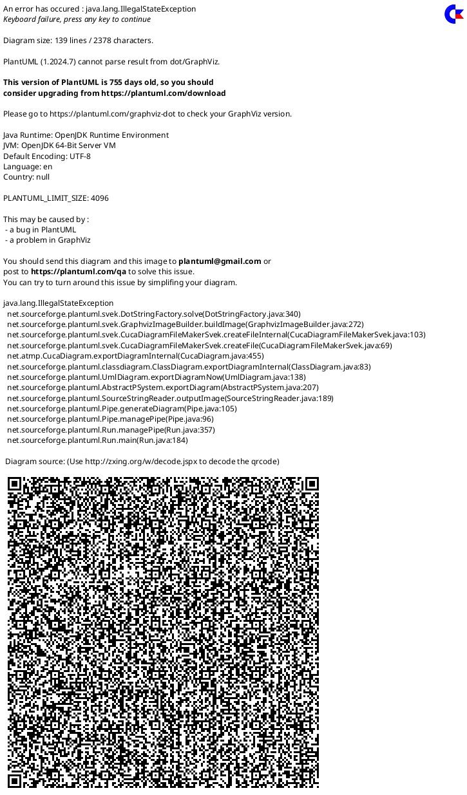
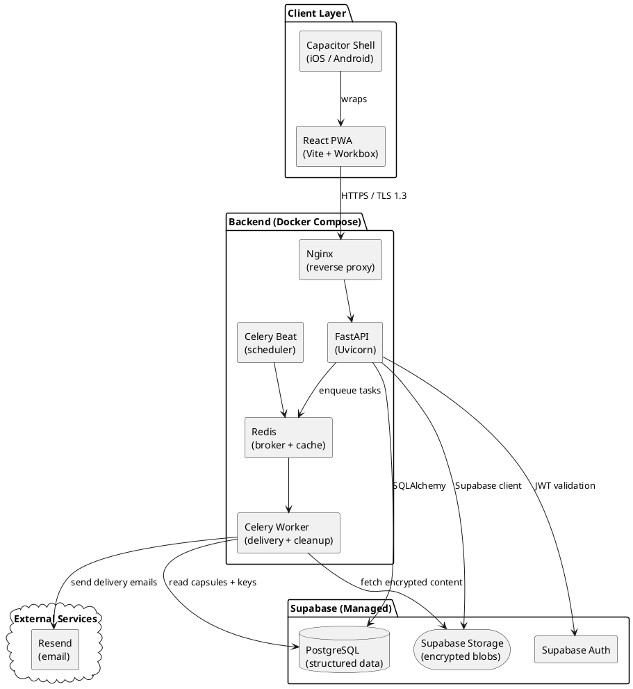
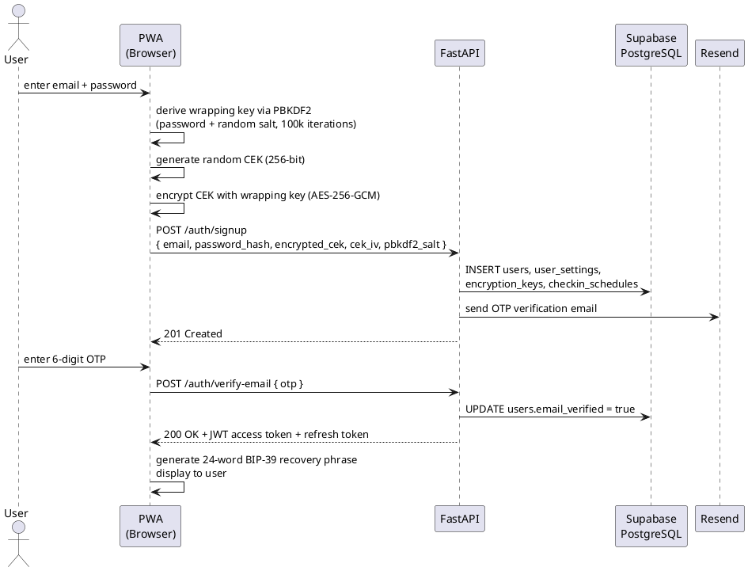
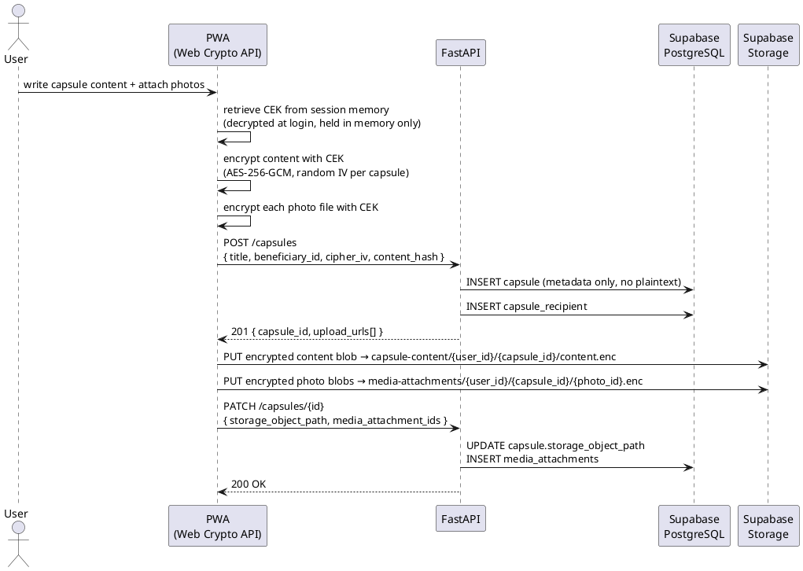
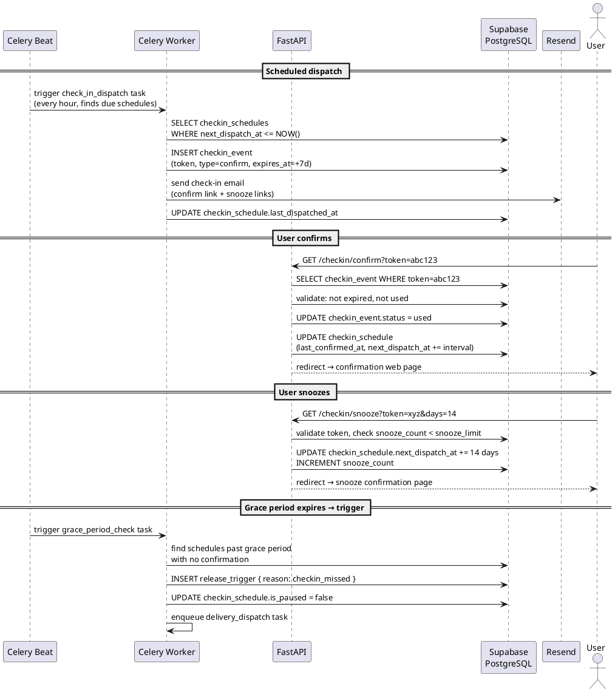
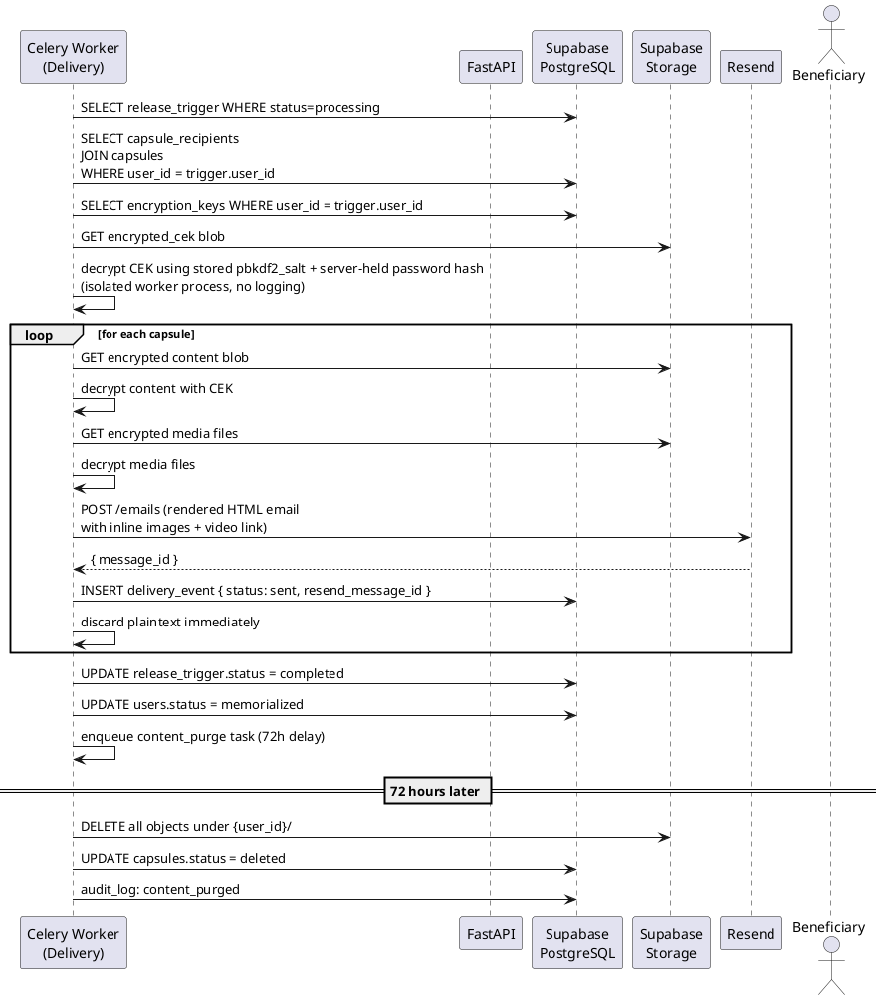
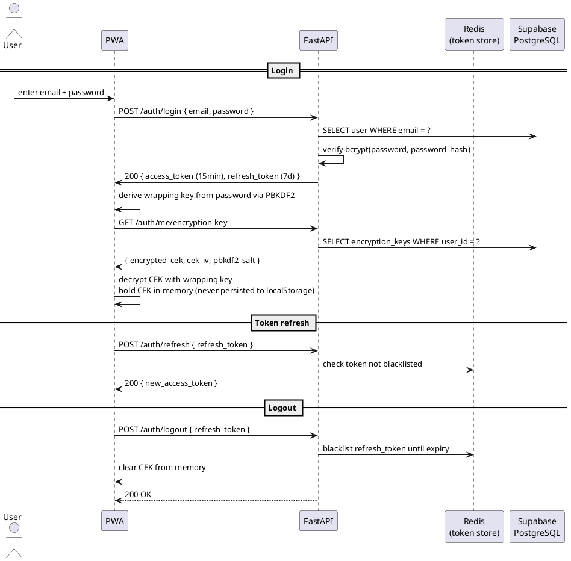
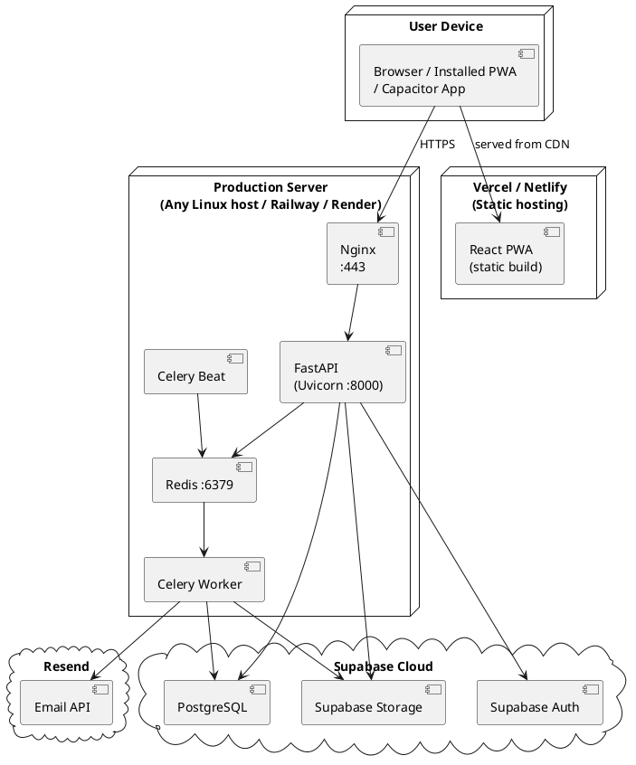
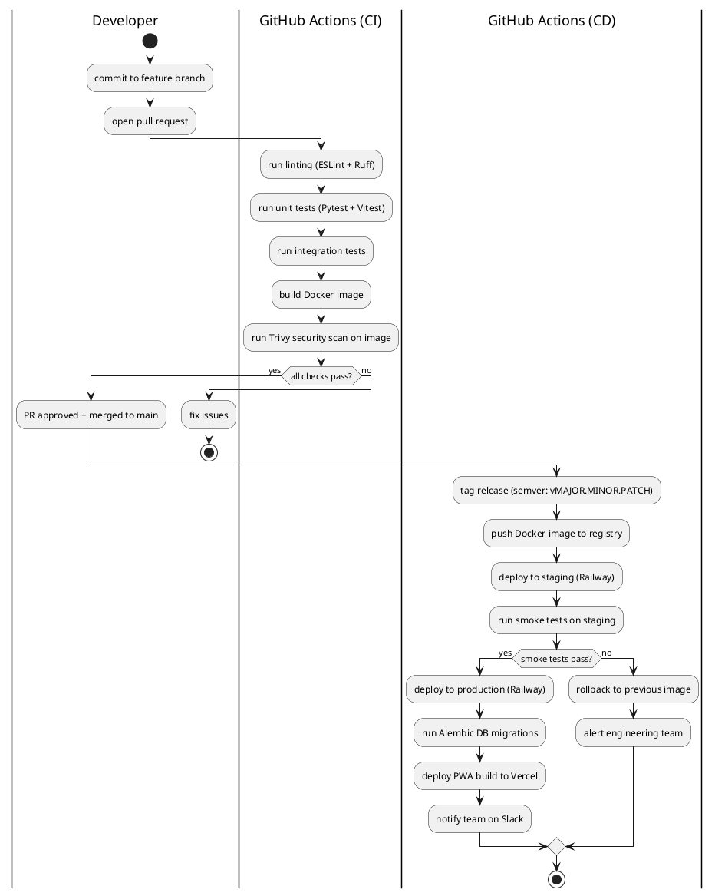

# Legate UML & Data Flow Diagrams v2.0

Revised for simplified architecture: Supabase + FastAPI + Celery + Redis + React PWA + Capacitor. Removed shard/node/seeder diagrams. Added deployment diagram, security flow diagram, and CI/CD lifecycle diagram.

---

## 1. Class Diagram



---

## 2. System Architecture Diagram



---

## 3. Sequence Diagrams

### 3.1 Account Creation & Key Setup



---

### 3.2 Capsule Creation (Hybrid Encryption)



---

### 3.3 Check-in Lifecycle



---

### 3.4 Delivery Pipeline



---

### 3.5 Authentication & Token Flow



---

## 4. User Journey Flowcharts

### 4.1 Primary User Journey

```
[Install PWA / open app]
        ↓
[Onboarding carousel (3 screens, skippable)]
        ↓
[Create account → email OTP verification]
        ↓
[Setup wizard]
  Step 1: Configure check-in interval + grace period
  Step 2: Add first beneficiary
  Step 3: Create first capsule (skippable)
  Step 4: Display + confirm BIP-39 backup phrase
        ↓
[Dashboard — active status]
        ↓
[Periodic check-in email received]
  → Click confirm → timer resets
  → Click snooze → timer extends
  → No action → grace period begins
        ↓ (grace period expires)
[Release trigger fires]
        ↓
[Delivery pipeline runs]
        ↓
[Beneficiaries receive emails]
        ↓
[Account enters memorial state]
        ↓
[Content purged after 72h]
```

### 4.2 Secondary Journey: Edit Capsule

```
[Capsules tab]
        ↓
[Select beneficiary → view capsule list]
        ↓
[Tap capsule → editor opens]
        ↓
[Edit text / add/remove photos]
        ↓
[Auto-save every 30s (local draft)]
        ↓
[Tap Save → re-encrypt with CEK → upload to Supabase Storage]
        ↓
[Old encrypted blob replaced → metadata updated]
```

### 4.3 Secondary Journey: Emergency Contact Pause

```
[Grace period expires with no check-in]
        ↓
[Celery worker emails emergency contact]
  "We haven't heard from [Name]. Click to pause delivery for 7 days."
        ↓
[Emergency contact clicks pause link]
        ↓
[API: GET /emergency/pause?token=...]
        ↓
[Validate token → check pause_count < 2]
        ↓
[UPDATE checkin_schedule: is_paused=true, pause_count++]
[UPDATE release_trigger: verification_state=cancelled]
        ↓
[User has 7 days to confirm they are OK]
  → User confirms → trigger cancelled, schedule resets
  → No confirm, 2nd pause available → emergency contact can pause again
  → Both pauses used, still no confirm → delivery proceeds
```

---

## 5. Deployment Diagram



---

## 6. CI/CD & Software Lifecycle Diagram



---

## 7. Security Architecture Overview

### 7.1 Trust Boundaries

| Zone | Components | Can access plaintext? |
|------|-----------|----------------------|
| User device | PWA, Capacitor shell, Web Crypto API, CEK in memory | Yes — only here |
| Backend API | FastAPI, token validation, metadata ops | No |
| Delivery worker | Isolated Celery process, decrypts at send time | Temporarily — discards immediately |
| Supabase | PostgreSQL, Storage | No — encrypted at rest + client-side encrypted |
| Redis | Token blacklist, task queue | No content |

### 7.2 Key Points
- CEK is **never stored in localStorage, sessionStorage, or any persistent browser store**. It is held in memory only for the duration of the session.
- The server stores only the **encrypted CEK blob** — it cannot decrypt content without the user's password.
- The delivery worker is the only component that ever holds plaintext — in memory only, never written to disk or logs.
- All tokens (check-in confirm, snooze, emergency pause) are **single-use** and stored in PostgreSQL. Used tokens are marked immediately. Redis blacklist provides a second layer for JWT revocation.
- Supabase Row Level Security ensures no user can query another user's rows even with a valid JWT.

---

## 8. API Endpoint Summary (Swagger at `/docs`)

| Method | Path | Auth | Description |
|--------|------|------|-------------|
| POST | `/auth/signup` | None | Create account |
| POST | `/auth/verify-email` | None | Verify OTP |
| POST | `/auth/login` | None | Login, get tokens |
| POST | `/auth/refresh` | Refresh token | Rotate access token |
| POST | `/auth/logout` | Access token | Blacklist refresh token |
| GET | `/auth/me` | Access token | Get current user |
| GET | `/auth/me/encryption-key` | Access token | Get encrypted CEK blob |
| GET | `/checkin/confirm` | Token param | Confirm check-in (no login) |
| GET | `/checkin/snooze` | Token param | Snooze check-in (no login) |
| GET | `/emergency/pause` | Token param | Emergency contact pause (no login) |
| GET | `/capsules` | Access token | List user's capsules |
| POST | `/capsules` | Access token | Create capsule metadata |
| GET | `/capsules/{id}` | Access token | Get capsule metadata |
| PATCH | `/capsules/{id}` | Access token | Update capsule |
| DELETE | `/capsules/{id}` | Access token | Delete capsule |
| GET | `/beneficiaries` | Access token | List beneficiaries |
| POST | `/beneficiaries` | Access token | Add beneficiary |
| PATCH | `/beneficiaries/{id}` | Access token | Update beneficiary |
| DELETE | `/beneficiaries/{id}` | Access token | Remove beneficiary |
| GET | `/settings/checkin` | Access token | Get check-in schedule |
| PATCH | `/settings/checkin` | Access token | Update check-in schedule |
| GET | `/settings/storage` | Access token | Get storage usage |
| DELETE | `/users/me` | Access token | Delete account (GDPR erasure) |

---

## 9. TODO / Next Steps

- Render PlantUML diagrams to SVG/PNG for report appendices (`plantuml legate_uml_diagrams_v2.md`)
- Add BPMN diagram for delivery pipeline trigger-to-send flow for report Chapter 4
- Define full OpenAPI schema (request/response bodies) in `/docs` — FastAPI generates this automatically from Pydantic models
- Write Alembic migration scripts once models are finalised
- Add activity diagram for offline sync behaviour (PWA draft cache → reconnect → upload)
